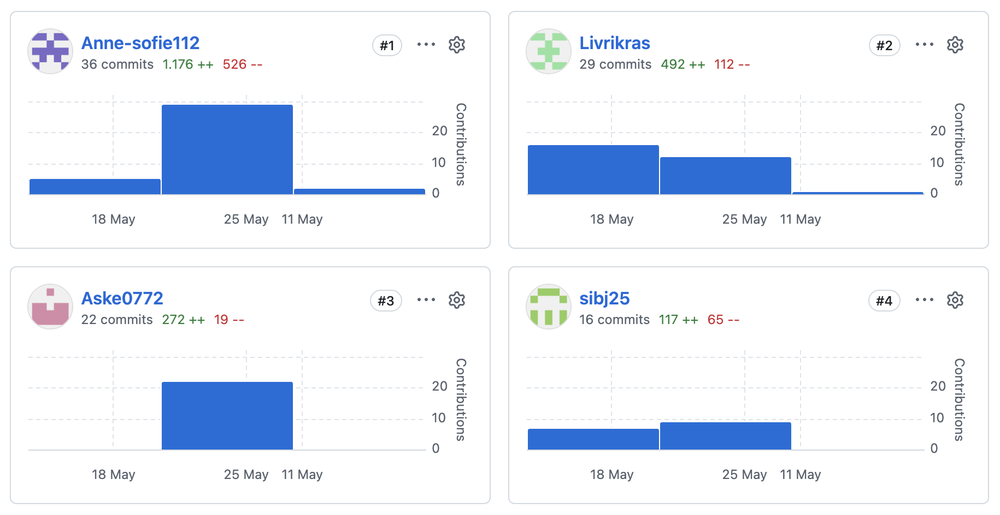
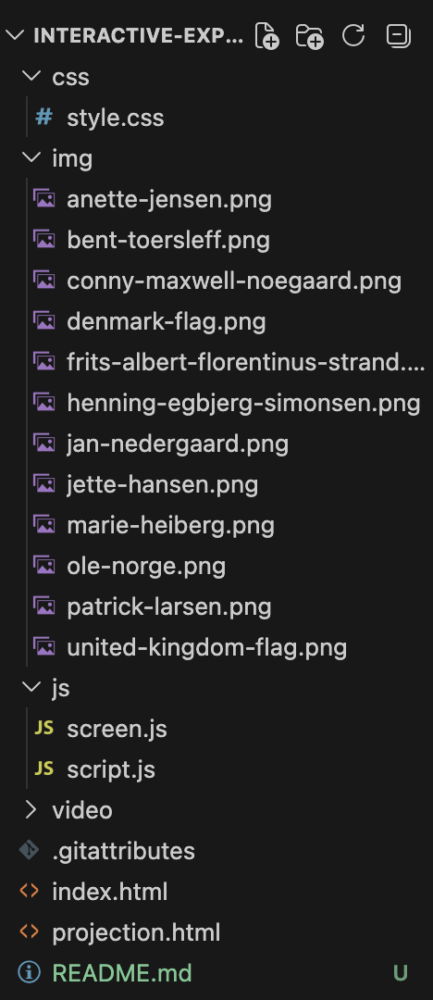
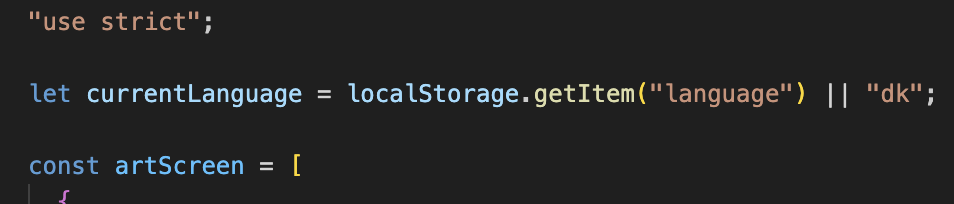
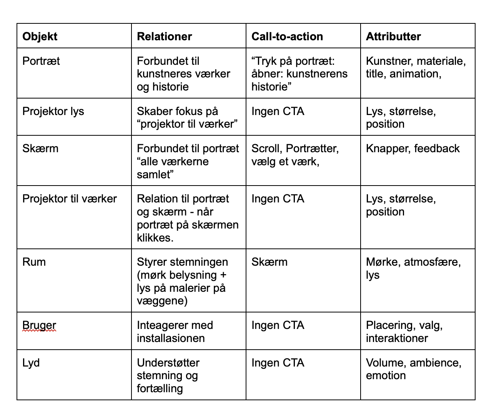

# README 

## Validering
Vi har brugt "W3C CSS Validation Service" og "W3C Markup Validation Service"

* Vi har ingen Warnings og ingen Errors

#### HTML: 
> index.html


> projection.html


#### CSS:
> style.css


## Collaborations
* Projektet er udviklet i fællesskab gennem GitHub med i alt ca. 141 commits
* Vi har arbejdet med push og pull for at sikre en struktureret udviklingsproces
* Vi har løbende testet og gennemgået koden
* Vi har delt opgaver ud på baggrund af interesse og kompetencer. Men alle medlemmer har bidraget til idéudvikling, design og udførslen




## Web konventioner


### Navne på mapper og filer
Vi har brugt kebab case til at skrive navne på filer til vores billeder og videoer, for at undgå at lave mellemrum, store bogstaver og andre specialtegn såsom æ, ø og å.


### Fil- og mappestruktur
Vi har lavet en overskuelig mappestruktur, hvor vi har inddelt alle filer i følgende mapper: css, js, img og video.

## Navne på variable og funktioner
Vi har navngivet variablerne og funktionerne ud fra hvad de gør.
fx:
`````
js

const artScreen //indeholder data om kunstnere og værker til vores skærm

projectionWindow //referer til projektvinduet
`````
Vi har brugt camel case på variabler og funktioner, hvor det andet ord får et stort bogstav.



* Vi har dog brugt kebab case til classes i html og css

## Fremhævet kode

## ORCA-model


I vores ORCA-model har vi haft fokus på at skrive objekter der spiller en central rolle i vores museumsinstallation.
Hvert objekt har en række attributter, der beskriver dets egenskaber.

Objekter:
* Portræt
* Lys
* Skærm
* Projektor
* Rum
* Brugeren
* Lyd

Vi har brugt ORCA-modellen til at definere portrætterne i projektet. Hvert portræt er som et objekt i vores JavaScript, som er blevet lavet i et array. Attributterne bliver til egenskaber såsom kunstner, årstal, materiale, img, videofil og beskrivelse.

````
js
"use strict";

const artScreen = [
  {
    id: 1,
    image: "img/frits-albert-florentinus-strand.png",
    name: "Frits A. F. Strand",
    year: "1853-1936",
    medium: "Olie på lærred",
    mediumEN: "Oil on canvas",
    size: "56x49 cm",
    description: "Frits A. F. Strands Motiver fremstår spontane og livlige, og kunstneren placerer ofte sig selv i centrum af sine billeder. Portrættet viser et enkelt og højtideligt udtryk, hvor fortællingen er vigtigere end den teknisk korrekte gengivelse.",
    descriptionEN: "Frits A. F. Strand's motifs appear spontaneous and lively, and the artist often places himself at the center of his paintings. The portrait shows a simple and solemn expression, where the narrative is more important than the technically correct representation.",
    videoDK: "video/frits-dansk.test.mp4",
    videoEN: "video/frits-engelsk.test.mp4",
  }
];
````

## JavaScript datastruktur
Datatyper vi har brugt:
* Arrays
* Objekter
* Strings
* Numbers til fx ID
* Bolean
* Function
* Null


## Kommentare
Kommentare kan ikke ses på webbrowseren, vi har brugt kommentare til at forstærke læsbarheden af selve koden for andre. Hvilket også har gjort det lettere at samarbejde i gruppen, så alle forstår hvad koden bliver brugt til.

Eksempel:
`````
js

// læser værdi ved localstorage i karrusel

let currentIndex = Number(localStorage.getItem("carouselIndex"));

if (!Number.isFinite(currentIndex)) {
  currentIndex = 0;
}
`````

## JavaScript bibliotek

Vi har brugt Vanilla JavaScript, HTML og CSS

Vi har ikke anvedt JavaScript biblioteker. Men vi har brugt GitHub til samarbejde og håndtering af projektet.


>Link til GitHub Repository: 
 https://github.com/Livrikras/interactive-experience-eksamen-26.git

> Link til GitHub pages:
    https://livrikras.github.io/interactive-experience-eksamen-26/ 

