# README

Denne README er skrevet af Anne-sofie Andsager Brandt, som har ansvaret for prototypeovervejelser. Jeg har lavet en figjam fil, hvor jeg går mere i dybden med prototype, ORCA og brugerflow. Linket til figjam ligger i bunden af README og er også linket til i min synopsis


## Indholdsfortegnelse

- [1. Validering](#1-validering)
- [2. Collaborations](#2-collaborations)
- [3. Web konventioner](#3-web-konventioner)
- [4. Navne på mapper og filer](#4-navne-på-mapper-og-filer)
- [5. Fil- og mappestruktur](#5-fil--og-mappestruktur)
- [6. Navne på variable og funktioner](#6-navne-på-variable-og-funktioner)

- [7. Fremhævet kode](#7-fremhævet-kode)
  - [7.1 Kodeeksempel 1](#71-kodeeksempel-1)
  - [7.2 Kodeeksempel 2](#72-kodeeksempel-2)

- [8. ORCA-model](#8-orca-model)
  - [8.1 Mapping mellem ORCA og JavaScript](#81-mapping-mellem-orca-og-javascript)

- [9. JavaScript datastruktur](#9-javascript-datastruktur)
  - [9.1 Datatyper](#91-datatyper)

- [10. Kommentarer](#10-kommentarer)

- [11. localStorage](#11-localstorage)
  - [11.1 Anvendte localStorage-værdier](#111-anvendte-localstorage-værdier)

- [12. Centrale valg i udviklingen](#12-centrale-valg-i-udviklingen)
  - [12.1 Tabletbaseret interaktion](#121-tabletbaseret-interaktion)
  - [12.2 Adskillelse af brugerinterface og projektion](#122-adskillelse-af-brugerinterface-og-projektion)
  - [12.3 Carousel som navigation](#123-carousel-som-navigation)
  - [12.4 Dynamisk rendering](#124-dynamisk-rendering)

- [13. JavaScript bibliotek](#13-javascript-bibliotek)

- [14. Brug af AI-værktøjer](#14-brug-af-ai-værktøjer)

- [15. links](#15-links)


## 1. Validering

Vi har brugt "W3C CSS Validation Service" og "W3C Markup Validation Service"

- Vi har ingen Warnings og ingen Errors

#### HTML:

> index.html
> 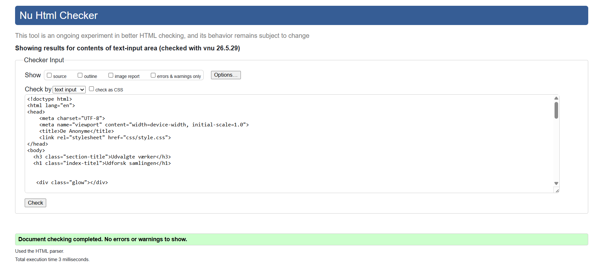

> projection.html
> 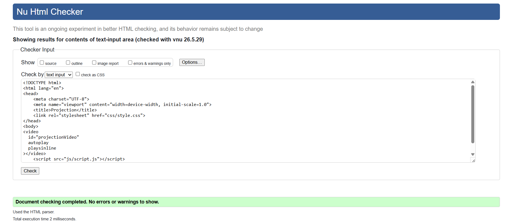

#### CSS:

> style.css
> 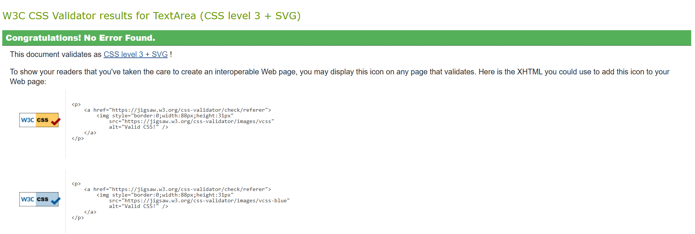

## 2. Collaborations

- Projektet er udviklet i fællesskab gennem GitHub med i alt ca. 162 commits
- Vi har arbejdet med push og pull for at sikre en struktureret udviklingsproces
- Vi har løbende testet og gennemgået koden
- Vi har delt opgaver ud på baggrund af interesse og kompetencer. Men alle medlemmer har bidraget til idéudvikling, design og udførslen

### Eksempler på commits

- if else betingelser som tilføjer klasser til kortene
- ny css fil oprettet for at ændre baggrund på projection.html
- styling af tilbage knap

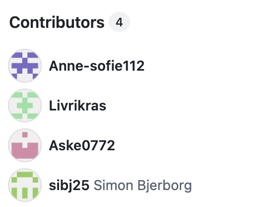

## 3. Web konventioner

For at holde projektet overskueligt valgte vi fra starten at følge nogle faste navngivningsregler. Alle filer og mapper er skrevet med små bogstaver, og vi har undgået mellemrum samt danske specialtegn som æ, ø og å. Det gjorde samarbejdet lettere, fordi alle arbejdede efter samme struktur, og samtidig blev projektet mere enkelt at vedligeholde.

## 4. Navne på mapper og filer

Vi har anvendt beskrivende og unikke navne på mapper og filer, så deres funktion fremgår tydeligt. Vi har brugt kebab case til navngivning af billeder og videofiler, for at undgå mellemrum og store bogstaver.

eksempler:

- `frits-albert-florentinus-strand.png`
- `projection.html`

## 5. Fil- og mappestruktur

for at skabe overblik over projektet har vi organiseret filerne i mapper efter deres funktion

```
interactive-experience
│
├── css
│   ├── projection.css
│   └── style.css
│
├── img
│
├── js
│   ├── screen.js
│   └── script.js
│
├── video
│
├── index.html
├── projection.html
├── README.md
└── .gitattributes
```

Mapperne indeholder:

**css/**
indeholder projektets stylesheets

**img/**
indeholder billeder, kunstværker og grafiske elementer

**js/**
indeholder JavaScript filerne, som styrer funktionaliteten i oplevelsen

**video/**
indeholder videofiler til de forskellige kunstværker

## 6. Navne på variable og funktioner

Vi har navngivet variablerne og funktionerne ud fra deres formål. Dette gør koden mere læsbar og lettere at forstå for os, som en gruppe. 

Eksempel:


```js 
const artScreen;
```
indeholder data om kunstværkerne i installationen. 

```js
let projectionWindow;
```
referer til projektionsvinduet, hvor videoerne afspilles.

Vi har konsekvent anvendt camelCase til JavaScript-variabler og funktioner, hvor det første ord skrives med lille begyndelsesbogstav og efterfølgende ord starter med stort bogstav

Eksempler:

```js
currentLanguage
selectedVideo
openProjectionWindow()
showStopProjectionButton()
```
Det gør koden lettere at læse og forstå

- Vi har dog brugt kebab case til classes i html og css

## 7. Fremhævet kode

### 7.1 Kodeeksempel 1
```js 

// Åbn eller genåbn projektionsvinduet hvis det er lukket
function openProjectionWindow() {
  if (!projectionWindow || projectionWindow.closed) {
    projectionWindow = window.open(
      "projection.html",
      "_blank",
      "width=1000, height=700",
    );
  }

  return projectionWindow;
}
```
Denne funktion åbner projektionsvinduet, hvis det ikke allerede er åbent. Hvis vinduet allerede eksisterer, genbruges det i stedet for at åbne et nyt. Funktionen er central for løsningen, da den skaber forbindelsen mellem brugergrænsefladen og projektionen. På den måde sikrer vi, at brugeren altid sender indhold til det samme projektionsvindue


### 7.2 Kodeeksempel 2

```js 

// Åbn og afspil video når kunstnerportrættet klikkes
  wrapper.addEventListener("click", () => {
    const selectedVideo =
      currentLanguage === "en" ? item.videoEN : item.videoDK;

    localStorage.setItem("selectedPortrait", selectedVideo);

    const win = openProjectionWindow();

    if (win && !win.closed) {
      win.postMessage(
        {
          video: selectedVideo,
        },
        "*",
      );

      showStopProjectionButton();
    }
  });
  // tilføjer wrapper til næste i rækken
  gallery.appendChild(wrapper);
  });
```
Denne kode registrerer når brugeren klikker på et kunstværk i carouselen. Først undersøger programmet, hvilket sprog brugeren har valgt. Derefter vælges den korrekte videofil og gemmes i localstorage. Til sidst sendes videofilen til projektionsvinduet ved hjælp af `postMessage()`. Koden er også en af de vigtigste dele af løsningen, da den forbinder brugerens valg på skærmen med den video, der afspilles på projektionen. Dermed skabes den interaktive oplevelse, hvor brugeren aktivt påvirker installationens indhold

## 8. ORCA-model

I vores ORCA-model har vi haft fokus på at skrive objekter der spiller en central rolle i vores museumsinstallation.
Hvert objekt har en række attributter, der beskriver dets egenskaber.

De centrale objekter:

- Portræt
- Lys
- Skærm
- Projektor
- Rum
- Brugeren
- Lyd
- Sprog
- Beskrivelse

Vi har brugt ORCA-modellen til at definere portrætterne i projektet. Hvert portræt er som et objekt i vores JavaScript, som er blevet lavet i et array. Attributterne bliver til egenskaber såsom kunstner, årstal, materiale, img, videofil og beskrivelse.

### 8.1 Mapping mellem ORCA og JavaScript

ORCA-modellen fungerede som grundlag for vores JavaScript datastruktur. Objektet **Portræt** blev omsat til JavaScript objekter i arrayet `artScreen`, mens attributterne blev omsat til properties.

Eksempelvis blev attributter som kunstner, årstal, materiale, beskrivelse og videofiler omsat til:

- `name`
- `year`
- `medium`
- `description`
- `descriptionEN`
- `videoDK`
- `videoEN`
- `accent`

Denne mapping gjorde det muligt at skabe en tydelig sammenhæng mellem konceptudviklingen, informationsarkitekturen og den tekniske implementering.
```js
"use strict";

const artScreen = [
  {
    id: 1,
    image: "img/frits-albert-florentinus-strand.png",
    name: "Frits A. F. Strand",
    year: "1853-1936",
    medium: "Olie på lærred",
    mediumEN: "Oil on canvas",
    size: "56x49 cm",
    description: "Frits A. F. Strands Motiver fremstår spontane og livlige, og kunstneren placerer ofte sig selv i centrum af sine billeder. Portrættet viser et enkelt og højtideligt udtryk, hvor fortællingen er vigtigere end den teknisk korrekte gengivelse.",
    descriptionEN: "Frits A. F. Strand's motifs appear spontaneous and lively, and the artist often places himself at the center of his paintings. The portrait shows a simple and solemn expression, where the narrative is more important than the technically correct representation.",
    videoDK: "video/frits-dansk.test.mp4",
    videoEN: "video/frits-engelsk.test.mp4",

  }
];
```

Udover dette har vi også tilføje en accent til hvert card, så de skiffter farve

## 9. JavaScript datastruktur

For at organisere indholdet i installationen har vi valgt at anvende et array af JavaScript-objekter.

Hvert objekt repræsenterer ét kunstværk og indeholder alle de oplysninger, som bruges i brugergrænsefladen og på projektionen. Datastrukturen fungerer derfor som projektets centrale datakilde.

Ved at samle alle oplysninger ét sted bliver det lettere at vedligeholde og udvide løsningen. Hvis et nyt kunstværk skal tilføjes, kan dette gøres ved blot at oprette et nyt objekt i arrayet.

### 9.1 Datatyper

Vi anvender flere forskellige datatyper i projektet:

**Array**  
Anvendes til at samle alle kunstværker i datastrukturen.

**Object**  
Hvert kunstværk repræsenteres som et objekt med tilhørende egenskaber.

**String**  
Anvendes til kunstnernavne, beskrivelser, materialer, billedstier og videostier.

**Number**  
Anvendes til ID-numre, så hvert kunstværk kan identificeres entydigt.

**Boolean**  
Anvendes ved logiske kontroller og betingelser i programmet.

**Function**  
Anvendes til at udføre handlinger såsom afspilning af video, opdatering af carousel og sprogskift.

**Null**  
Anvendes som standardværdi, når en værdi endnu ikke er defineret.


## 10. Kommentarer

Kommentare kan ikke ses på webbrowseren, vi har brugt kommentare til at forstærke læsbarheden af selve koden for andre. Hvilket også har gjort det lettere at samarbejde i gruppen, så alle forstår hvad koden bliver brugt til. De er allesammen på Dansk

Eksempel: 

```
js

// læser værdi ved localstorage i karrusel

let currentIndex = Number(localStorage.getItem("carouselIndex"));

if (!Number.isFinite(currentIndex)) {
  currentIndex = 0;
}
```
## 11. localStorage

For at skabe en mere dynamisk brugeroplevelse har vi anvendt browserens `localStorage`. localStorage gør det muligt at gemme data lokalt i browseren, så information kan bevares mellem forskellige dele af løsningen.

I vores projekt anvendes localStorage blandt andet til at gemme brugerens valg af portræt og position i carouselen. Dette gør det muligt at videreføre information mellem brugergrænsefladen og projektionsvinduet.

Når brugeren vælger et portræt, gemmes den tilhørende videofil i localStorage:

```js
localStorage.setItem("selectedPortrait", selectedVideo);
```

Den gemte værdi kan efterfølgende hentes og bruges til at vise det korrekte indhold:

```js
let currentIndex = Number(
  localStorage.getItem("carouselIndex")
);
```

Ved at anvende localStorage opfylder løsningen kravet om persistens, da brugerens valg kan gemmes og genanvendes under oplevelsen. Dette bidrager til en mere sammenhængende og personlig interaktion med installationen.

### 11.1 Anvendte localStorage-værdier

- `selectedPortrait` – gemmer den valgte videofil.
- `carouselIndex` – gemmer brugerens position i carouselen.
- `currentLanguage` – gemmer det valgte sprog (hvis I bruger dette).

localStorage fungerer derfor som et vigtigt bindeled mellem brugerens handlinger og den dynamiske tilpasning af indholdet i installationen.

## 12. Centrale valg i udviklingen

Gennem udviklingen af installationen traf vi en række tekniske og designmæssige valg for at understøtte den ønskede brugeroplevelse.

### 12.1 Tabletbaseret interaktion

Vi valgte bevidst ikke at anvende hover-effekter i interfacet, da installationen er udviklet til en tablet. Hover funktionalitet er primært relevant på computere med mus, mens vores løsning er baseret på touch interaktioner. Vi har lavet active: løsninger i stedet for. 


### 12.2 Adskillelse af brugerinterface og projektion

Vi valgte at opdele installationen i et brugerinterface og et separat projektionsvindue. Dette gjorde det muligt at lade brugeren navigere i indholdet på én skærm, mens videoerne blev afspillet på en anden.

### 12.3 Carousel som navigation

Vi valgte at præsentere kunstværkerne i en carousel frem for en traditionel liste. Dette gør det muligt at vise flere værker på begrænset plads og skaber en mere interaktiv oplevelse.

### 12.4 Dynamisk rendering

Vi valgte at generere indholdet dynamisk gennem JavaScript frem for at oprette hvert portræt manuelt i HTML. Dette reducerer mængden af kode og gør løsningen lettere at udvide.


## 13. JavaScript bibliotek

Projektet er udviklet ved hjælp af HTML, CSS og Vanilla JavaScript.

Vi overvejede kort at bruge eksterne JavaScript biblioteker, men vurderede, at projektets behov kunne dækkes med Vanilla JavaScript. Derfor valgte vi at holde løsningen simpel.

Vi har blandt andet arbejdet med:

- EventListeners
- localStorage
- postMessage()
- DOM Manipulation
- Dynamisk rendering

Disse har gjort det muligt at skabe en interaktiv installation, hvor brugerens valg påvirker det indhold, der vises på projektionen.

## 14. Brug af AI-værktøjer
I vores projekt har vi undervejs brugt AI som et digitalt værktøj til at samarbejde og vejlede under forløbet. Vi har til projektet brugt ChatGPT, Higgsfield, 11Labs, Weavi.ai og CoPilot (VScode)

* __Fejlsøgning og spørgsmål:__ Vi har brugt CoPilot til JavaScript i VS code til at vejlede ift. eventuelle spørgsmål eller fejl i selve koden.

* __Kunstneres tanker til installation:__ Vi har brugt ChatGPT til at give inspiration til kunstnernes tanker og følelser i vores installation, vi har brugt chatten som samarbejdspartner her, for at analysere deres tanker og følelser, baseret på den information vi har fået fra museets om kunstnerne. https://chatgpt.com/share/6a267e50-44c8-83eb-8f32-50e0850fb079 og https://chatgpt.com/share/6a267e7e-a600-83eb-be44-7d104867325f (Link hentet: 8/6/2026)

* __Moodboard og inspiration til storyboard:__ Vi har brugt ChatGPT til at teste vores ide, hvor vi har fået chatten til at visualisere vores installation i rummet, samt give en lidt mere specifik vibe og følelse til moodboard. Dette gør det nemmere for vores BERT testpersonerne at få fornemmelse for installationen. https://chatgpt.com/share/6a267f9b-28d4-83ed-98c4-4a640d3f6226 (Link hentet: 8/6/2026)

* __Billeder til designoplæg:__ Vi har brugt Higgsfield og Weavi.ai  til at genere billederne til vores designoplæg, hvor vi viser et mere detaljeret overblik over oplevelsen. (Med Higgsfield og Weavi.ai, kan vi ikke linke til chatten, da det er en privat account. Derfor har vi tilføjet billeder ind i stedet)(Sat ind d. 8/6/2026)
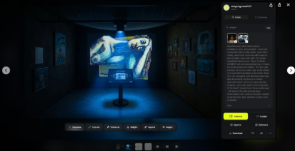
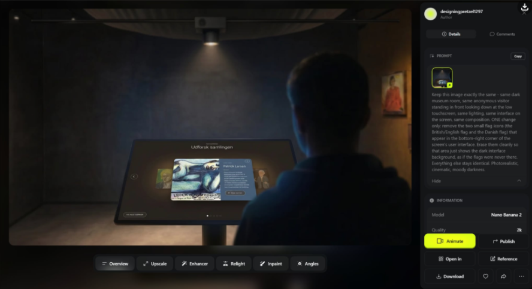
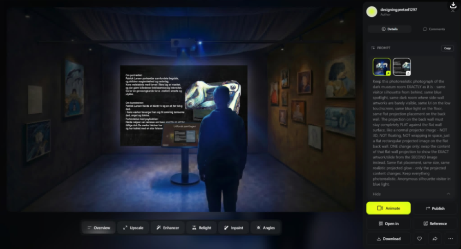
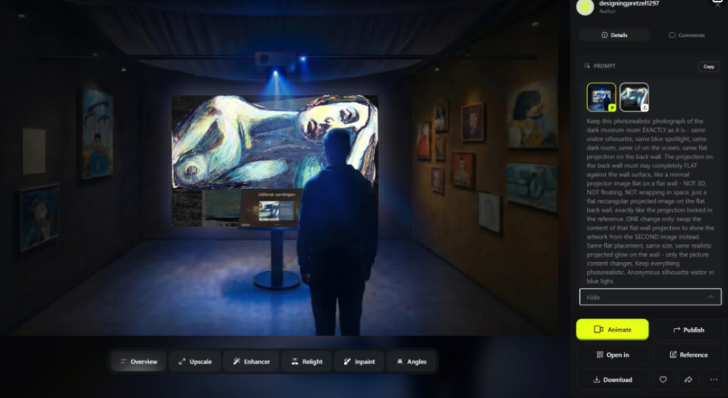

__Prompts:__
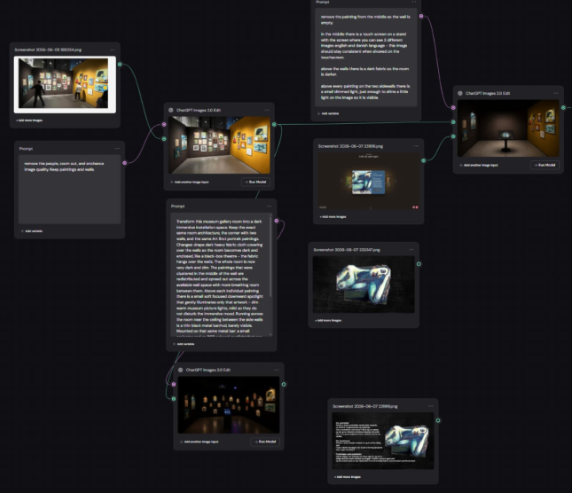
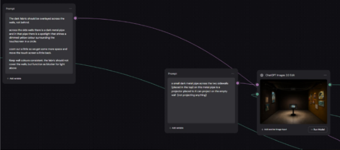
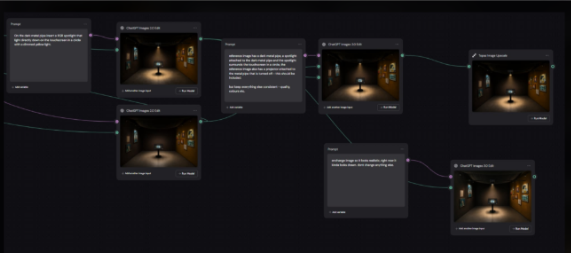


* __Engelske voiceover og baggrundslyde:__ Vi har brugt 11Labs til at genere engelske voiceovers, i stedet for at indtale dem som vi har gjort med de danske. Med 11Labs har vi brugt forskellige stemmer til at give den rette stemning for hver kunstner. Vi har også brugt 11Labs til at lave baggrundsmusik og effekter til de danske voiceovers.
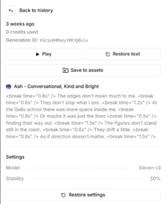 Ash - voice id: m3yAHyFEFKtbCIM5n7GF
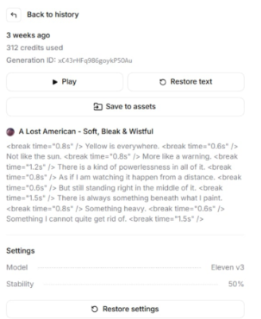 Ash - voice id: enI44SIiQ2GsKAhWRSpZ
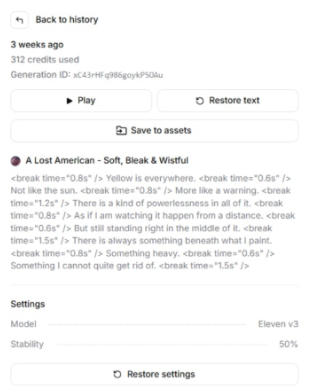 Ash - voice id: wVOQaU8CfoRJqCWsxoLv
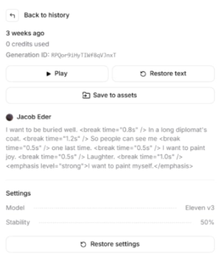 Ash - voice id: 0c14Fsfhfnl8M9pCB5pf
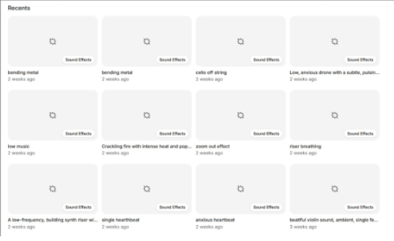 Billeder hentet ned: 8/6/2026

Vi har brugt AI som både en samarbejdspartner men også til at designe lyd osv. som skulle bruges i vores installation. AI hjælp og lyde er blevet tilpasset, testet og redigeret i, så vi har fuld forståelse og intention for alt hvad vi har sat ind.

### 15 Links
> Link til GitHub Repository:
> https://github.com/Livrikras/interactive-experience-eksamen-26.git

> Link til GitHub pages:
https://livrikras.github.io/interactive-experience-eksamen-26/

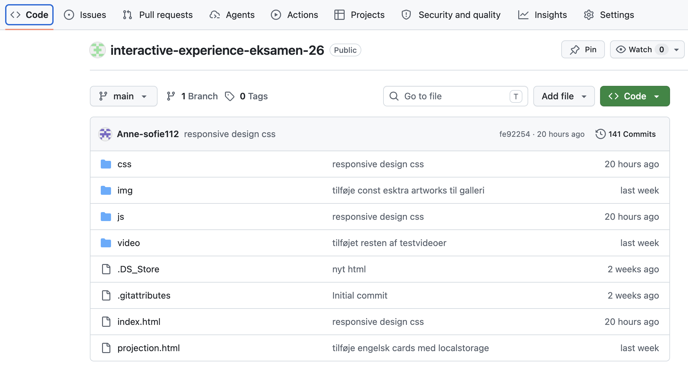
